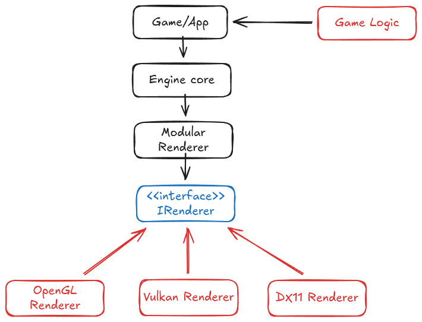

# LithTech-style Renderer Demo

A LithTech-style modular renderer technical demo.


## Design Goals

This project explores a LithTech-style inspired renderer architecture, where the game
code depends on a renderer-agnostic interface (`IRenderer.h`) and concrete rendering
backends are implemented as interchangeable modules.

This modular system requires **normalized drawing operations**, which refer to a small,
renderer-agnostic set of high-level drawing commands (e.g. sprites, quads, batches)
implemented by each backend.

This is not intended to be a full engine, but a technical exploration of modular
renderer design and backend interchangeability.

## Architecture diagram

<p align="center">
  
</p>


## Project files structure

```sh
.
├── README.md       # This file
├── CMakeLists.txt  # root CMake file
├── engine
│   ├── CMakeLists.txt
│   ├── include
│   │   └── IRenderer.h
│   └── src
│       └── Engine.cpp
├── game
│   ├── CMakeLists.txt
│   ├── include
│   │   └── DemoScene.h
│   └── src
│       ├── DemoScene.cpp
│       └── main.cpp
└── renderers
    └── OGL4REN
        ├── CMakeLists.txt
        ├── gl.c
        ├── include
        │   ├── glad
        │   │   └── gl.h
        │   └── KHR
        │       └── khrplatform.h
        ├── RendererOGL4.cpp
        ├── RendererOGL4.h
        └── shaders
            ├── sprite.frag
            └── sprite.vert

12 directories, 17 files
```


## Build and run

**Linux, Makefile generator**:

```sh
mkdir build && cd build && cmake ..
make && cd game
./game
```

**Windows, MSVC solution generator**:

```sh
mkdir build && cd build && cmake ..
msbuild Modular2DEngine.sln /p:Configuration=Release /p:Platform=x64
cd game
game.exe
```
**Windows, MSVC solution generator** with manual SDL2-dev package files path:

```sh
cmake .. -DSDL2_DIR=C:\SDL2-2.32.10\cmake
msbuild Modular2DEngine.sln /p:Configuration=Release /p:Platform=x64 /p:AdditionalIncludeDirectories="C:\SDL2-2.32.10\include"
cd game
game.exe
```

## Windows-specific notes

**SDL2 Runtime dependency**:
You must have a `SDL2.dll` copy located in the same directory as the executable. For both legal and practical reasons, using the dynamic library (`.dll`) is preferred over static linking.

**Official SDL2 MSVC development package layout**:
The official SDL2 dev package for MSVC use a header layout that may not match the expected include path style `<SDL2/...>`. If you extract SDL2 to a PATH, eg. "C:\SDL2-2.32.10/", apply the following changes:

```sh
cd "C:\SDL2-2.32.10"
move include SDL2
mkdir include
move SDL2 include
```
After this adjustment, the compiler will correctly resolve headers using `#include <SDL2/...>`.


## TODO

 1.  Code cleanup and general refactoring.
 2.  Add more "**normalized drawing operations**".
 3.  Reimplement LearnOpenGL tutorials using these "**normalized drawing operations**" as a **testing framework**.
 4.  Implement simple 2D games to **demonstrate functionality**.
 5.  Refactor these 2D games to use **Lua scripting** instead of hardcoded game logic.


## OPTIONAL

 1.  Add `Legacy OpenGL`, `Vulkan` and `DirectX 11` support through `IRenderer.h` interface.
 2.  Decouple SDL2 dependency through an `IPlatform.h` interface as a modular platform layer.
 3.  If implemented, add `GLFW` support through `IPlatform.h` interface.
 4.  If implemented, decouple the embedded Lua scripting system through an `IScriptingVM.h` interface.


